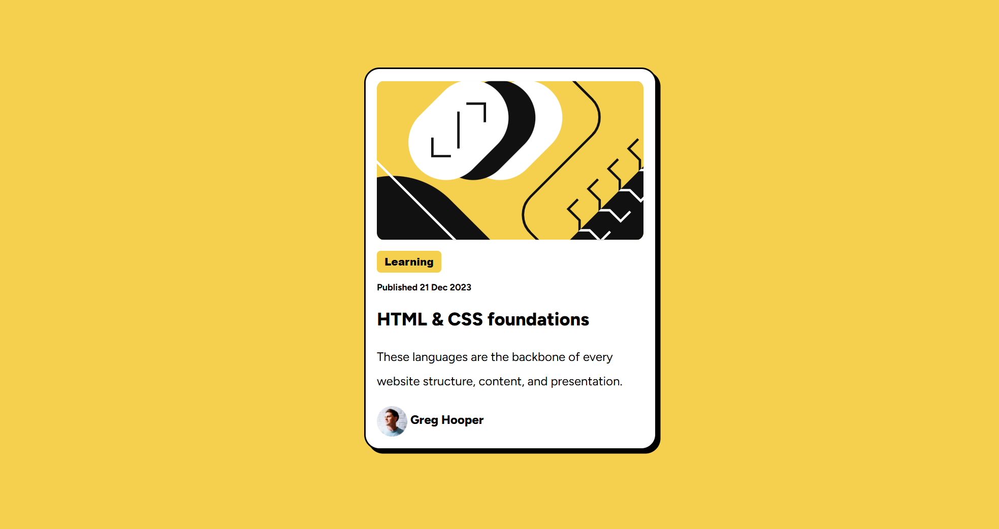

# Frontend Mentor - Blog preview card solution
This is my solution to the blog preview card challenge available on FrontendMentor (https://www.frontendmentor.io/challenges/blog-preview-card-ckPaj01IcS). Frontend mentor allows users to test skills in html and CSS to encourage improvement in practical coding skills. 

### The challenge 
The challenge was to recreate a blog preview card by utilizing our knowledge of CSS and html coding, working to get it as close to the original design as possible. 

### Screenshot

## My process
  I created the framework for my site using what I have learned with html and utilized css to help create the color scheme and try to match as close to the template as possible. 

### Built with

- Semantic HTML5 markup
- CSS custom properties

